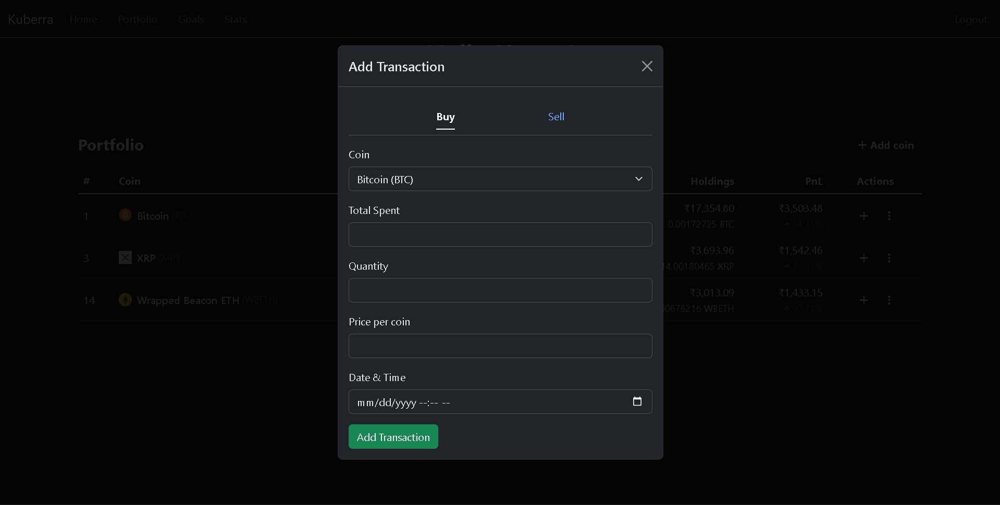

# Kubera — finance tool  
> minimal, clean, self-hosted personal finance + crypto tracker  

## 👤 Author & Links

**Krupa Koushik (Kouza)**  

[](https://www.linkedin.com/in/krupa-koushik-kona-355708296/)  
[](https://x.com/krupakoushikk)

---

## 🛠️ Tech Stack  

[](#) 
[](#) 
[](#) 
[](#) 
[](#) 
[](https://www.coingecko.com/en/api)

---

## 💡 About  

Kubera is a minimal personal finance app with:  
- 💸 **Expense tracker** (+ custom categories)  
- ₿ **Crypto portfolio** (live prices via CoinGecko)  
- 🧾 **Trade ledger** (FIFO PnL + holdings)  
- 🔐 Auth + per-user data  

> Built with Flask + SQLite. Inspired by CoinGecko’s clean portfolio UX.

---

## ✨ Screenshots  

A peek into Kubera’s clean UI (CoinGecko-inspired):

| login | dashboard | add transaction | category | portfolio | trades | add coin | buy/sell |
| --- | --- | --- | --- | --- | --- | --- | --- |
|  |  |  |  |  |  |  |  |

---

## 🧱 Features  

- Categories CRUD (per user)  
- Add/edit/delete transactions  
- Add coins from CoinGecko search/trending  
- Per-coin holdings with **FIFO** unrealized/realized PnL  
- Trade page with FIFO PnL per sell, average cost, totals  
- Simple caching for market data (Pro key optional)  

---

## 🗺️ Roadmap  

- 📊 Budgeting per category (monthly caps + alerts)  
- 🎯 Savings goals (time-bound plans, progress bars)  
- 📈 Visualizations (pandas/matplotlib or Chart.js)  
- 🧠 “Insights” (OpenAI) — spending patterns, goal nudges, basic investing hygiene  
- 🔔 Email/Discord/webhook notifications  

---

## 🚀 Quickstart  

```bash
# 1) clone
git clone https://github.com/<you>/kubera.git
cd kubera

# 2) create venv
python -m venv .venv
# windows: .venv\Scripts\activate
source .venv/bin/activate

# 3) install
pip install -r requirements.txt

# 4) env
cp .env.example .env
# fill values (see below)

# 5) run
flask --app main.py --debug run
# app: http://127.0.0.1:5000
