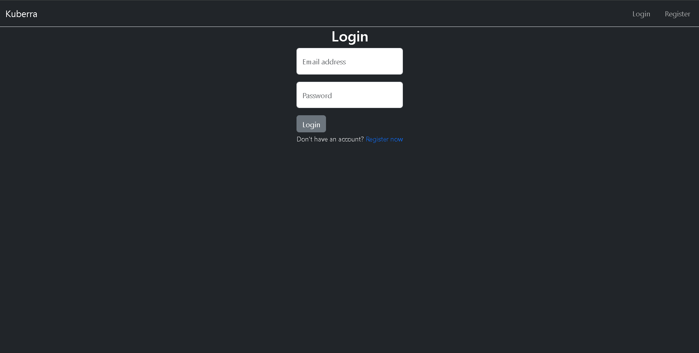
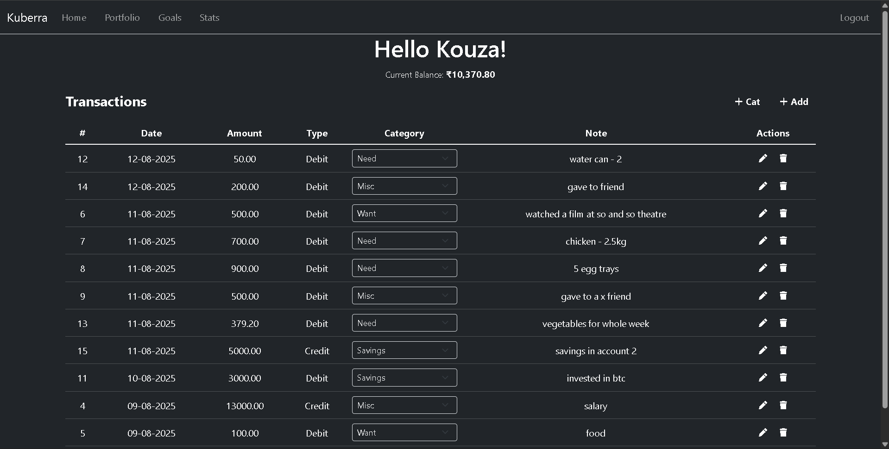
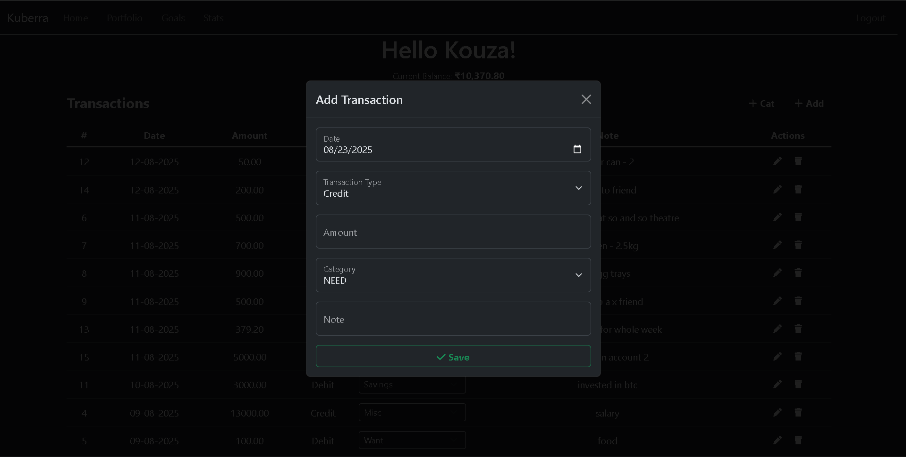
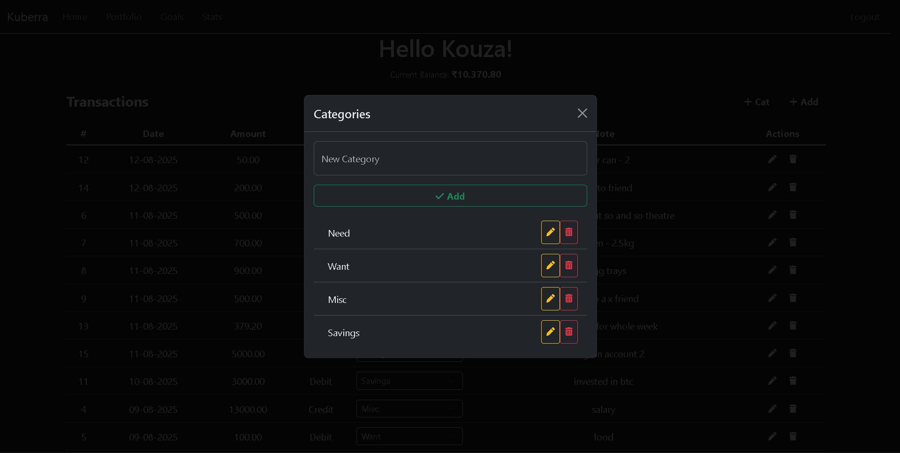
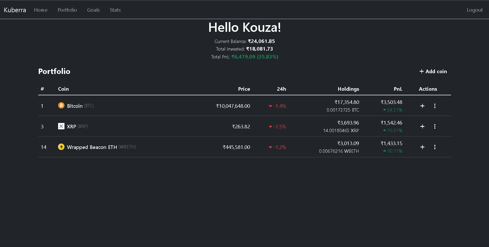
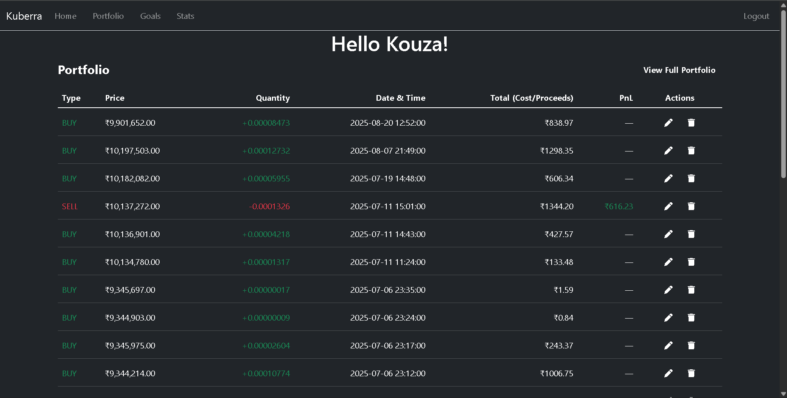
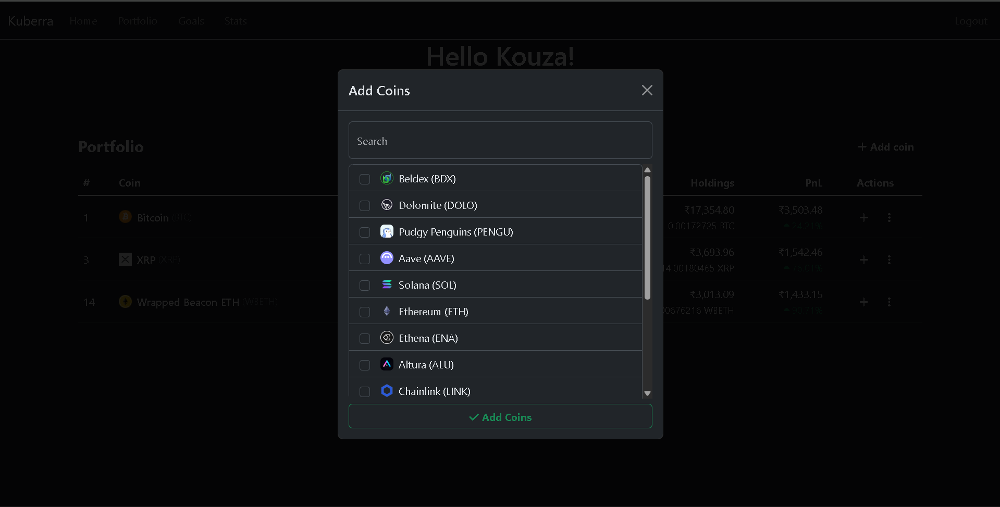

# Kubera — expense + crypto tracker

## 👤 Author & Links

**Krupa Koushik (Kouza)**  

[](https://www.linkedin.com/in/krupa-koushik-kona-355708296/)  
[](https://x.com/krupakoushikk)


[](#)
[](#)
[](#)
[](#license)
[](#contributing)

a minimal personal finance app with:
- 💸 **expense tracker** (+ custom categories)
- ₿ **crypto portfolio** (live prices via CoinGecko)
- 🧾 **trade ledger** (FIFO PnL + holdings)
- 🔐 auth + per‑user data

> built with Flask + SQLite. inspired by CoinGecko’s clean portfolio UX.

---

## ✨ screenshots

| login | dashboard | modal (add transaction) | modal (category) | portfolio | trades | modal (coin) | modal (buy/sell) |
| --- | --- | --- | --- | --- | --- | --- | --- |
|  |  |  |  |  |  |  |  |

> add more as you like. files live under `images/`.

---

## 🧱 features

- categories CRUD (per user)
- add/edit/delete transactions
- add coins from CoinGecko search/trending
- per‑coin holdings with **FIFO** unrealized/realized PnL
- trade page with FIFO PnL per sell, average cost, totals
- simple caching for market data (Pro key optional)

---

## 🗺️ roadmap

- 📊 budgeting per category (monthly caps + alerts)
- 🎯 savings goals (time‑bound plans, progress bars)
- 📈 visualizations (pandas/matplotlib or Chart.js)
- 🧠 “insights” (OpenAI) — spending patterns, goal nudges, basic investing hygiene
- 🔔 email/Discord/webhook notifications

---

## 🚀 quickstart

```bash
# 1) clone
git clone https://github.com/<you>/kubera.git
cd kubera

# 2) create venv
python -m venv .venv
# windows: .venv\Scripts\activate
source .venv/bin/activate

# 3) install
pip install -r requirements.txt

# 4) env
cp .env.example .env
# fill values (see below)

# 5) run
flask --app main.py --debug run
# app: http://127.0.0.1:5000
